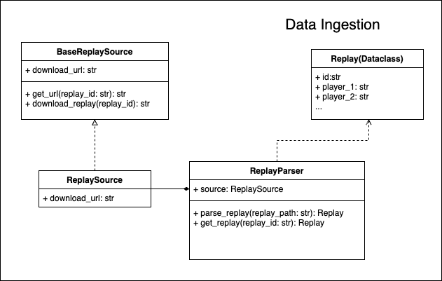

# Data Ingestion

Data ingestion was a huge part that we failed to get right last time. The below document is the beginning of trying to outline how we can create a simpler process for managing replays.

Some important information to consider:

- Replays are assigned an integer id, which is used to create download URLs for various replay websites (need to validate this). This can be used to our advantage for downloading replays.
- We need to download replays in two separate scenarios:
    1. When building a training dataset we need to be able to download and filter a large batch of replays, and store them somewhere in the cloud. This will allow us to share a consistent training set during model development.
    2. For inference we need to be able to download and ingest a single replay into memory based on it's ID. We should also offer replay ingestion from a local file. 
- Our representation of a replay should be adaptable. It is unreasonable to hold ALL replay information for a first version. But we want to be able to iterateivly add new information from the raw replay file into our replay definition, as we begin to consider more complex features.


## The Diagram



### ReplaySource
A `ReplaySource` is a simplified representation of a replay storage website. It provides a download URL for the source, which can be used to download replays given a `replay_id`. The downloading code belongs to the parent class, and can be shared across sources.

Example:
```python
class SpawningToolSource(ReplaySource):
    def __init__(self):
        self.download_url = "https://lotv.spawningtool.com/{replay_id}/download/"
```


### ReplayParser
The `ReplayParser` is responsable for getting and parsing replays. It uses a source to 